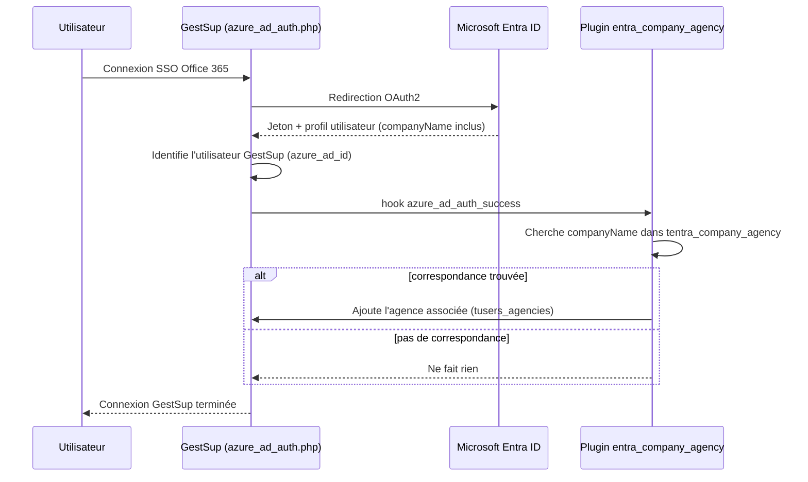
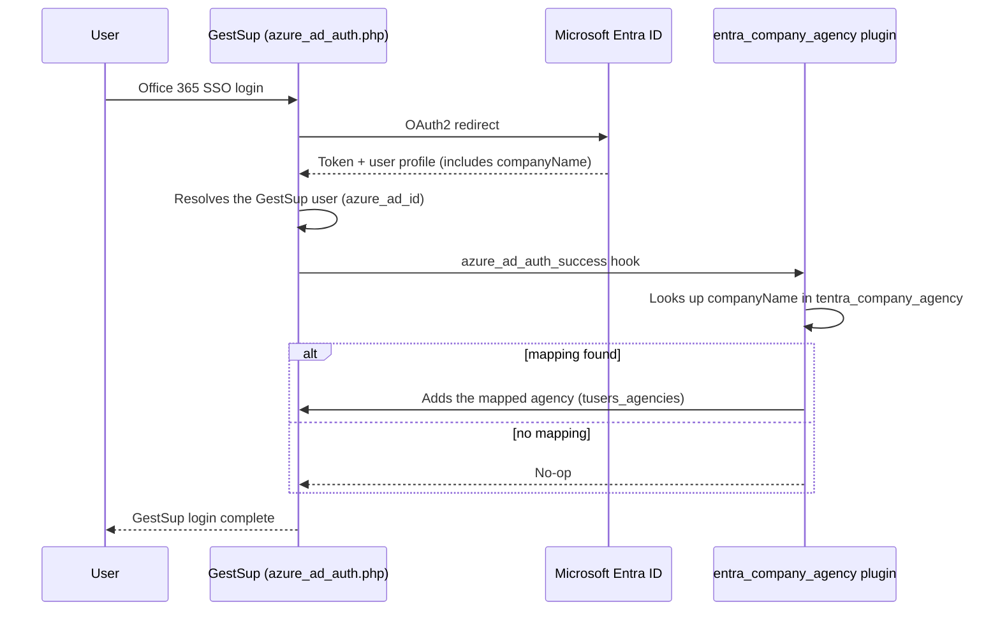

<div align="center">

# 🏢 GestSup — Entra ID Company ↔ Agency

**Plugin GestSup qui associe automatiquement l'agence d'un utilisateur à sa société Microsoft Entra ID (Azure AD) lors de la connexion SSO Office 365.**
**GestSup plugin that automatically links a user's agency to their Microsoft Entra ID (Azure AD) company on Office 365 SSO login.**


[🇫🇷 Français](#-français) · [🇬🇧 English](#-english)

</div>

---

## 🇫🇷 Français

### Sommaire

- [Le problème](#le-problème)
- [Comment ça fonctionne](#comment-ça-fonctionne)
- [Fonctionnalités](#fonctionnalités)
- [Prérequis](#prérequis)
- [Structure du dépôt](#structure-du-dépôt)
- [Installation](#installation)
- [Utilisation](#utilisation)
- [Le patch core (3 lignes)](#le-patch-core-3-lignes)
- [Désinstallation](#désinstallation)
- [Dépannage](#dépannage)
- [Sécurité](#sécurité)
- [Limitations connues](#limitations-connues)
- [Changelog](#changelog)

### Le problème

GestSup permet de connecter les utilisateurs via SSO Office 365 (Microsoft Entra ID). À la connexion, GestSup sait *qui* se connecte, mais rien ne relie automatiquement la **société** de l'utilisateur côté Entra ID (`companyName`) à une **agence** GestSup (`tagencies`). Ce plugin comble cet écart : vous définissez une fois la correspondance société ↔ agence, et GestSup l'applique automatiquement à chaque connexion SSO.

### Comment ça fonctionne



Le plugin **n'enlève jamais** une agence déjà associée à l'utilisateur : il complète, il ne remplace pas.

### Fonctionnalités

- ✅ Association automatique société Entra ID → agence GestSup à chaque connexion SSO
- ✅ Page d'administration dédiée (liste, ajout, modification, suppression des correspondances)
- ✅ Liste déroulante des sociétés déjà connues de GestSup (`tcompany`) — pas de saisie libre source de fautes de frappe
- ✅ Installation/désinstallation/activation via l'interface standard **Administration > Paramètres > Plugins**
- ✅ Interface bilingue **Français / Anglais**, s'adapte à la langue de l'utilisateur connecté
- ✅ Aucune donnée existante modifiée ni supprimée : le plugin ne fait qu'ajouter des associations manquantes
- ✅ Journalisation dans les logs GestSup (`tlogs`) de chaque création/modification/suppression

### Prérequis

| | |
|---|---|
| **GestSup** | ≥ 3.2.5x avec le connecteur SSO Entra ID / Azure AD déjà configuré et fonctionnel |
| **PHP** | 8.1+ |
| **Accès** | Accès SSH/FTP au serveur GestSup + accès administrateur GestSup |
| **Tables utilisées** | `tcompany`, `tagencies`, `tusers`, `tusers_agencies`, `tplugins` (déjà présentes dans GestSup) |

### Structure du dépôt

```
.
├── plugin/
│   └── entra_company_agency/          # Le plugin, à copier tel quel dans plugins/
│       ├── entra_company_agency.php   # Page d'administration (liste + formulaire)
│       ├── azure_ad_auth_success.php  # Logique de liaison, exécutée au hook SSO
│       ├── menu.php                   # Lien de menu (visible admin uniquement)
│       ├── page_white_list.php        # Déclare la page auprès du cœur GestSup
│       ├── changelog.php              # Notes de version (affichées dans l'UI plugin)
│       ├── locale/
│       │   ├── fr_FR.php              # Traductions françaises
│       │   └── en_US.php              # Traductions anglaises
│       └── _SQL/
│           ├── install.sql            # Créé la table + enregistre le plugin
│           └── uninstall.sql          # Supprime la table + désenregistre le plugin
├── core-patch/                        # 3 lignes à appliquer au cœur GestSup (voir plus bas)
│   ├── install.sh                     # Applique les 3 diffs + (optionnel) le SQL du plugin
│   ├── plugin.php.diff
│   ├── azure_ad_auth.php.diff
│   └── azure_ad_auth2.php.diff
└── README.md
```

### Installation

1. **Copier le plugin** dans votre installation GestSup :
   ```bash
   cp -r plugin/entra_company_agency /chemin/vers/gestsup/plugins/
   chown -R gestsup:www-data /chemin/vers/gestsup/plugins/entra_company_agency
   find /chemin/vers/gestsup/plugins/entra_company_agency -type d -exec chmod 750 {} \;
   find /chemin/vers/gestsup/plugins/entra_company_agency -type f -exec chmod 640 {} \;
   ```
   *(adaptez utilisateur/groupe et permissions à votre configuration serveur)*

2. **Appliquer le patch core** — deux méthodes possibles :

   **Automatique (recommandé)** : le script détecte si le patch est déjà appliqué (sans risque de le faire deux fois), sauvegarde chaque fichier avant modification, et annule automatiquement si un fichier ne correspond pas à ce qui est attendu (version de GestSup trop différente) :
   ```bash
   ./core-patch/install.sh /chemin/vers/gestsup
   ```
   Exemple de sortie :
   ```
   OK    plugin.php patched (backup: /chemin/vers/gestsup_core_backup_20260703_162436/plugin.php)
   OK    azure_ad_auth.php patched (backup: ...)
   OK    azure_ad_auth2.php patched (backup: ...)
   ```
   Si un fichier a trop divergé de la version d'origine, le script s'arrête proprement (`FAIL`, fichier laissé intact) et vous invite à appliquer la modification manuellement.

   **Manuelle** : voir le détail des 3 lignes à ajouter [plus bas](#le-patch-core-3-lignes), ou appliquez les fichiers `.diff` vous-même avec `patch -p1 < core-patch/xxx.diff` depuis la racine de GestSup.

3. **Installer le SQL du plugin** (table `tentra_company_agency` + enregistrement dans `tplugins`) — GestSup ne propose **aucune page "Store" qui fait cela automatiquement**, il faut le faire explicitement, par l'une de ces deux méthodes :

   **Via `install.sh`** (recommandé, idempotent — sans risque de le relancer) : passez les identifiants de connexion à la base en plus du chemin GestSup, et le script applique le patch core *et* le SQL en une seule commande :
   ```bash
   ./core-patch/install.sh /chemin/vers/gestsup --db-name bsup --db-user gestsup
   # invite le mot de passe interactivement ; ou --db-pass '...' pour un usage non interactif
   # --db-host / --db-port optionnels (défaut : localhost / 3306)
   ```

   **Manuelle** :
   ```bash
   mysql -u <user> -p <database> < plugin/entra_company_agency/_SQL/install.sql
   ```

4. Dans GestSup, aller dans **Administration > Paramètres > Plugins**, ouvrir l'onglet du plugin ("Sociétés Entra ID"), cocher **Activer le plugin**, valider.

5. Le lien **Sociétés Entra ID** apparaît dans le menu principal (visible uniquement par les profils Administrateur).

> ⚠️ Pour pouvoir **installer/désinstaller** un plugin directement depuis l'interface web (téléchargement, suppression de fichiers), le processus PHP doit avoir les droits d'écriture sur le dossier `plugins/`. Si ce n'est pas le cas (configuration recommandée en production, cf. [Sécurité](#sécurité)), l'installation initiale des fichiers et la désinstallation se font manuellement en SSH/SFTP — seule l'activation/désactivation (simple bascule en base) fonctionne toujours depuis l'UI.

### Utilisation

Depuis la page **Sociétés Entra ID** :

1. Choisissez une société dans la liste déroulante (alimentée depuis vos sociétés GestSup existantes, `tcompany`).
2. Choisissez l'agence GestSup à associer.
3. Enregistrez.

À la prochaine connexion SSO d'un utilisateur dont l'attribut `companyName` Entra ID correspond exactement à la société choisie, l'agence est automatiquement ajoutée à son profil GestSup.

> 💡 **Astuce** : l'attribut `companyName` doit correspondre **exactement** (texte brut, sensible à l'orthographe) à ce que vous sélectionnez. En cas de doute sur la valeur exacte envoyée par Entra ID, vérifiez le profil Microsoft 365 de l'utilisateur (Centre d'administration > Utilisateurs > Profil > Société).

### Le patch core (3 lignes)

GestSup ne propose pas nativement de point d'extension ("hook") à l'endroit exact où le profil Entra ID est reçu après authentification SSO. Ce plugin ajoute ce point d'extension une bonne fois pour toutes — de façon **générique et réutilisable** par n'importe quel futur plugin, pas seulement celui-ci :

<details>
<summary><strong>plugin.php</strong> (registre central des hooks GestSup)</summary>

```diff
     if($section=='page_white_list' && file_exists('plugins/'.$plugin['name'].'/page_white_list.php')) {include('plugins/'.$plugin['name'].'/page_white_list.php');}
+    //azure ad auth success (successful Entra ID SSO login)
+    if($section=='azure_ad_auth_success' && file_exists('plugins/'.$plugin['name'].'/azure_ad_auth_success.php')) {include('plugins/'.$plugin['name'].'/azure_ad_auth_success.php');}
     //favicon
```
</details>

<details>
<summary><strong>azure_ad_auth.php</strong> et <strong>azure_ad_auth2.php</strong> (identique dans les deux fichiers)</summary>

```diff
             if(!empty($gs_user['id']))
             {
+                //plugin hook: post Entra ID SSO login logic (e.g. entra_company_agency plugin)
+                $section='azure_ad_auth_success';
+                include('plugin.php');
+
                 echo 'Entra ID authentification successful, connection to GestSup...';
```
</details>

Les diffs complets sont dans [`core-patch/`](core-patch/). Ces lignes n'embarquent **aucune logique métier** : toute la logique vit dans le plugin, qui survit intact aux mises à jour de GestSup. Seul ce patch de 3 lignes doit être réappliqué après une mise à jour du cœur GestSup (quelques minutes).

### Désinstallation

**Depuis l'UI** (si le processus PHP a les droits d'écriture sur `plugins/`) : Administration > Paramètres > Plugins > onglet du plugin > **Désinstaller**. Supprime la table, la ligne `tplugins` et les fichiers.

**Manuellement** :
```bash
mysql -u <user> -p <database> < plugin/entra_company_agency/_SQL/uninstall.sql
rm -rf /chemin/vers/gestsup/plugins/entra_company_agency
```
Retirez ensuite les 3 lignes de patch core (ou laissez-les : elles sont inertes sans le dossier plugin).

### Dépannage

| Symptôme | Cause probable | Solution |
|---|---|---|
| `PDOException: Query was empty` à l'ouverture de l'onglet Plugins | `install.sql`/`uninstall.sql` contient un caractère (souvent un retour à la ligne) après le dernier `;` — le parseur GestSup fait un simple `explode(";", ...)` sans nettoyage | Vérifier qu'aucun octet ne suit le dernier `;` du fichier SQL |
| La page du plugin retombe sur "Gestion des utilisateurs" | Vous avez essayé de router la page via `admin&subpage=...` au lieu du système de page plugin (`page=plugins/...`) | Utiliser le hook `page_white_list`, pas la liste blanche `subpage` du cœur |
| Le bouton "Désinstaller" échoue avec une erreur de droits | Le process PHP (souvent `www-data`) n'a pas les droits d'écriture sur `plugins/` (bonne pratique en prod) | Désinstaller manuellement en SSH (voir ci-dessus) |
| L'agence ne se lie pas à la connexion SSO | `companyName` Entra ID ne correspond pas **exactement** (au caractère près) à la société sélectionnée dans le plugin | Vérifier la valeur exacte dans le profil Microsoft 365 de l'utilisateur |
| Rien ne se passe, plugin activé, mapping correct | Le plugin est peut-être désactivé (`tplugins.enable=0`) | Vérifier l'onglet Plugins dans Administration |
| Le menu "Sociétés Entra ID" n'apparaît jamais, table `tentra_company_agency` absente | Le SQL du plugin n'a jamais été installé — GestSup n'a **aucune page qui le fait automatiquement** | Lancer `install.sh` avec `--db-name`/`--db-user`, ou exécuter `_SQL/install.sql` à la main (voir [Installation](#installation)) |

### Sécurité

- Toutes les requêtes SQL sont préparées (PDO, requêtes paramétrées) — aucune concaténation de valeurs utilisateur dans le SQL.
- La page d'administration est protégée par `$rright['admin']` (droit administrateur GestSup requis).
- Les valeurs affichées sont systématiquement échappées (`htmlspecialchars`) avant rendu HTML.
- Aucune information sensible (secrets, jetons) n'est manipulée par ce plugin : il ne fait que lire `companyName` depuis la réponse Microsoft Graph déjà authentifiée par le connecteur SSO natif de GestSup.

### Limitations connues

- Le libellé et la description du plugin affichés dans l'onglet **Administration > Plugins** (table `tplugins`) restent en français : GestSup ne propose pas de mécanisme multilingue pour ces deux champs (le plugin de référence `availability` a la même limitation). Le **reste de l'interface** (menu, page, messages) est, lui, bilingue et suit la langue de l'utilisateur connecté.
- La correspondance se fait par égalité stricte sur `companyName` — pas de tolérance à la casse ou aux accents. C'est un choix délibéré pour éviter les faux positifs.

### Changelog

**1.0** — Version initiale : correspondance société Entra ID / agence, page d'administration, interface FR/EN.

---

## 🇬🇧 English

### Table of contents

- [The problem](#the-problem)
- [How it works](#how-it-works)
- [Features](#features)
- [Requirements](#requirements)
- [Repository layout](#repository-layout)
- [Installation](#installation-1)
- [Usage](#usage)
- [The core patch (3 lines)](#the-core-patch-3-lines)
- [Uninstalling](#uninstalling)
- [Troubleshooting](#troubleshooting)
- [Security](#security)
- [Known limitations](#known-limitations)
- [Changelog](#changelog-1)

### The problem

GestSup supports Office 365 SSO login via Microsoft Entra ID. On login, GestSup knows *who* is signing in, but nothing automatically links the user's Entra ID **company** (`companyName`) to a GestSup **agency** (`tagencies`). This plugin closes that gap: define the company ↔ agency mapping once, and GestSup applies it automatically on every SSO login.

### How it works



The plugin **never removes** an agency already linked to the user: it only adds missing links, never replaces existing ones.

### Features

- ✅ Automatic Entra ID company → GestSup agency link on every SSO login
- ✅ Dedicated admin page (list, add, edit, delete mappings)
- ✅ Dropdown of companies already known to GestSup (`tcompany`) — no free-text field, no typos
- ✅ Install/uninstall/enable through the standard **Administration > Parameters > Plugins** screen
- ✅ Bilingual **French / English** UI, follows the logged-in user's language
- ✅ Non-destructive: only adds missing associations, never edits or deletes existing user data
- ✅ Every create/update/delete is logged to GestSup's own log table (`tlogs`)

### Requirements

| | |
|---|---|
| **GestSup** | ≥ 3.2.5x with the Entra ID / Azure AD SSO connector already configured and working |
| **PHP** | 8.1+ |
| **Access** | SSH/FTP access to the GestSup server + GestSup administrator account |
| **Tables used** | `tcompany`, `tagencies`, `tusers`, `tusers_agencies`, `tplugins` (already part of GestSup) |

### Repository layout

```
.
├── plugin/
│   └── entra_company_agency/          # The plugin, copy as-is into plugins/
│       ├── entra_company_agency.php   # Admin page (list + form)
│       ├── azure_ad_auth_success.php  # Linking logic, runs on the SSO hook
│       ├── menu.php                   # Menu link (admin-only)
│       ├── page_white_list.php        # Registers the page with GestSup core
│       ├── changelog.php              # Release notes (shown in the plugin UI)
│       ├── locale/
│       │   ├── fr_FR.php              # French strings
│       │   └── en_US.php              # English strings
│       └── _SQL/
│           ├── install.sql            # Creates the table + registers the plugin
│           └── uninstall.sql          # Drops the table + unregisters the plugin
├── core-patch/                        # 3 lines to apply to GestSup core (see below)
│   ├── install.sh                     # Applies the 3 diffs + (optional) the plugin's SQL
│   ├── plugin.php.diff
│   ├── azure_ad_auth.php.diff
│   └── azure_ad_auth2.php.diff
└── README.md
```

### Installation

1. **Copy the plugin** into your GestSup install:
   ```bash
   cp -r plugin/entra_company_agency /path/to/gestsup/plugins/
   chown -R gestsup:www-data /path/to/gestsup/plugins/entra_company_agency
   find /path/to/gestsup/plugins/entra_company_agency -type d -exec chmod 750 {} \;
   find /path/to/gestsup/plugins/entra_company_agency -type f -exec chmod 640 {} \;
   ```
   *(adjust user/group/permissions to your server setup)*

2. **Apply the core patch** — two options:

   **Automatic (recommended)**: the script detects whether the patch is already applied (safe to re-run), backs up each file before touching it, and rolls back automatically if a file doesn't match what's expected (too different a GestSup version):
   ```bash
   ./core-patch/install.sh /path/to/gestsup
   ```
   Example output:
   ```
   OK    plugin.php patched (backup: /path/to/gestsup_core_backup_20260703_162436/plugin.php)
   OK    azure_ad_auth.php patched (backup: ...)
   OK    azure_ad_auth2.php patched (backup: ...)
   ```
   If a file has diverged too much from the original, the script stops cleanly (`FAIL`, file left untouched) and asks you to apply the change manually.

   **Manual**: see the 3 lines to add [below](#the-core-patch-3-lines), or apply the `.diff` files yourself with `patch -p1 < core-patch/xxx.diff` from the GestSup root.

3. **Install the plugin's SQL** (the `tentra_company_agency` table + its `tplugins` row) — GestSup has **no "Store" page that does this automatically**, it has to be run explicitly, either way:

   **Via `install.sh`** (recommended, idempotent — safe to re-run): pass DB credentials alongside the GestSup path and the script applies the core patch *and* the SQL in one command:
   ```bash
   ./core-patch/install.sh /path/to/gestsup --db-name bsup --db-user gestsup
   # prompts for the password interactively; or --db-pass '...' for non-interactive use
   # --db-host / --db-port are optional (default: localhost / 3306)
   ```

   **Manual**:
   ```bash
   mysql -u <user> -p <database> < plugin/entra_company_agency/_SQL/install.sql
   ```

4. In GestSup, go to **Administration > Parameters > Plugins**, open the plugin's own tab ("Entra ID Companies"), check **Enable plugin**, submit.

5. The **Entra ID Companies** link appears in the main menu (Administrator profiles only).

> ⚠️ Installing/uninstalling a plugin directly from the web UI (downloading, deleting files) requires the PHP process to have write access to the `plugins/` folder. If it doesn't (recommended production setup, see [Security](#security)), the initial file deployment and uninstall must be done manually over SSH/SFTP — enabling/disabling (a simple DB flag) still works from the UI either way.

### Usage

From the **Entra ID Companies** page:

1. Pick a company from the dropdown (populated from your existing GestSup companies, `tcompany`).
2. Pick the GestSup agency to associate.
3. Save.

On the next SSO login of a user whose Entra ID `companyName` matches the selected company exactly, the agency is automatically added to their GestSup profile.

> 💡 **Tip**: `companyName` must match **exactly** (plain text, case-sensitive) what you select. If unsure of the exact value Entra ID sends, check the user's Microsoft 365 profile (Admin center > Users > Profile > Company name).

### The core patch (3 lines)

GestSup has no built-in extension point ("hook") at the exact spot where the Entra ID profile is received right after SSO authentication. This plugin adds that hook once and for all — as a **generic, reusable** extension point for any future plugin, not just this one:

<details>
<summary><strong>plugin.php</strong> (GestSup's central hook registry)</summary>

```diff
     if($section=='page_white_list' && file_exists('plugins/'.$plugin['name'].'/page_white_list.php')) {include('plugins/'.$plugin['name'].'/page_white_list.php');}
+    //azure ad auth success (successful Entra ID SSO login)
+    if($section=='azure_ad_auth_success' && file_exists('plugins/'.$plugin['name'].'/azure_ad_auth_success.php')) {include('plugins/'.$plugin['name'].'/azure_ad_auth_success.php');}
     //favicon
```
</details>

<details>
<summary><strong>azure_ad_auth.php</strong> and <strong>azure_ad_auth2.php</strong> (identical change in both files)</summary>

```diff
             if(!empty($gs_user['id']))
             {
+                //plugin hook: post Entra ID SSO login logic (e.g. entra_company_agency plugin)
+                $section='azure_ad_auth_success';
+                include('plugin.php');
+
                 echo 'Entra ID authentification successful, connection to GestSup...';
```
</details>

Full diffs are in [`core-patch/`](core-patch/). These lines carry **no business logic** — everything lives in the plugin, which survives GestSup core updates untouched. Only this 3-line patch needs reapplying after a GestSup core update (a couple of minutes).

### Uninstalling

**From the UI** (if the PHP process has write access to `plugins/`): Administration > Parameters > Plugins > plugin tab > **Uninstall**. Removes the table, the `tplugins` row and the files.

**Manually**:
```bash
mysql -u <user> -p <database> < plugin/entra_company_agency/_SQL/uninstall.sql
rm -rf /path/to/gestsup/plugins/entra_company_agency
```
Then remove the 3 core patch lines (or leave them — they're inert without the plugin folder).

### Troubleshooting

| Symptom | Likely cause | Fix |
|---|---|---|
| `PDOException: Query was empty` when opening the Plugins tab | `install.sql`/`uninstall.sql` has a stray character (often a trailing newline) after the last `;` — GestSup's parser does a naive `explode(";", ...)` with no trimming | Make sure nothing follows the last `;` in the SQL file |
| The plugin page falls back to "User management" | You tried routing through `admin&subpage=...` instead of the plugin page system (`page=plugins/...`) | Use the `page_white_list` hook, not core's `subpage` whitelist |
| "Uninstall" fails with a permissions error | The PHP process (often `www-data`) has no write access to `plugins/` (a good production practice) | Uninstall manually over SSH (see above) |
| Agency doesn't get linked on SSO login | Entra ID's `companyName` doesn't match the selected company **exactly** | Check the exact value in the user's Microsoft 365 profile |
| Nothing happens, plugin enabled, mapping correct | Plugin might actually be disabled (`tplugins.enable=0`) | Check the Plugins tab in Administration |
| "Entra ID Companies" menu never shows up, `tentra_company_agency` table missing | The plugin's SQL was never installed — GestSup has **no page that does this automatically** | Run `install.sh` with `--db-name`/`--db-user`, or run `_SQL/install.sql` by hand (see [Installation](#installation-1)) |

### Security

- All SQL queries are parameterized (PDO prepared statements) — no user input is ever concatenated into SQL.
- The admin page is gated by `$rright['admin']` (GestSup administrator right required).
- All displayed values are escaped (`htmlspecialchars`) before HTML output.
- No sensitive data (secrets, tokens) is handled by this plugin: it only reads `companyName` from the Microsoft Graph response already authenticated by GestSup's native SSO connector.

### Known limitations

- The plugin's label/description shown in the **Administration > Plugins** tab (`tplugins` table) stays in French: GestSup has no multi-language mechanism for those two fields (the reference `availability` plugin has the same limitation). The **rest of the UI** (menu, page, messages) is fully bilingual and follows the logged-in user's language.
- Matching is a strict equality check on `companyName` — no case- or accent-insensitive matching. This is deliberate, to avoid false positives.

### Changelog

**1.0** — Initial release: Entra ID company / agency mapping, admin page, FR/EN UI.

---

<div align="center">

Développé et testé sur un environnement de préproduction GestSup.
Built and tested against a GestSup preproduction environment.

</div>
